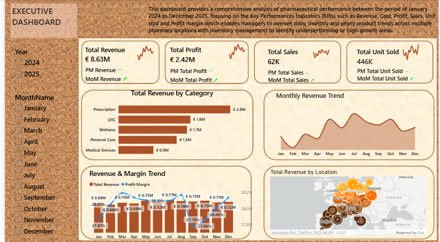
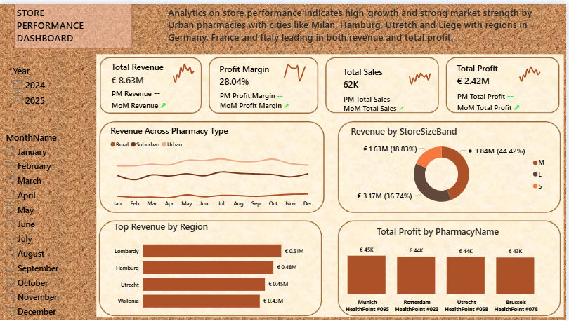

# PHARMACY_SALES_PERFORMANCE_ANALYSIS

## PROJECT OVERVIEW
This project presents a comprehensive Pharmacy Sales Performance Analysis developed using Microsoft Poer BI. The analysis covers sales from January 2024 to December 2025, providing insights into revenue, profit, sales volume, units sold, store performance, products performance, regional performance and business trends. This project consists of three interactive dashboard views;
- Executive dashboard.
- Store performance dashboard.
- Products performance dashboard.

 ## PROJECT OBJECTIVES
 - Analyze overall pharmacy sales performance.
 - Monitor revenue, profit, sales and units sold.
 - Evaluate profitability and profit margins.
 - Identify monthly sales and revenue trends.
 - identify high-performing products, categories, regions and country.
 - identify business opportunities and areas requiring improvement.

 ## KEY PERFORMANCE INDICATORS
KPI                               RESULT
Total Revenue                     8.63M (EURO)
Total Profit                      2.42M (EURO)
Total Sales                       62K
Total Units Sold                  446K
Total Cost                        6.21M (EURO)
Profit Margin                     28.04%

 ## DASHBOARD PREVIEW
1. Executive Dashboard provides a high-level view of pharmacy business performance including revenue, profit, sales, unit sold,            category   performance and geographical performance.
   
 

2. Store Performance Dashboard evaluates pharmacy performance by pharmacy type, store size, region and individual pharmacy location.

  

3. Products Performance Dashboard analyzes product categories, brands, revenue, profit margin, pack sizes, regional profit and country-     level revenue.

 

 ## KEY INSIGHTS
 - Total revenue generated was 8.63M (EURO).
 - Total profit was 2.42M (EURO).
 - Overall profit margin was 28.04%.
 - Total units sold was 446K.
 - Prescription products were among the strongest revenue-generating categories.
 - Germany generated the highest revenue among countries displayed.
 - Lombardy, Hamburg, Uretcht and Wallonia were among the leading regions by revenue.

## BUSINESS RECOMMENDATION
 - Prioritize high-revenue and high-margin products for inventory planning and promotional campaigns.
 - focus marketing and expansion strategies on high-performing regions and pharmacy locations.
 - monitor monthly revenue trends to improve demand forecasting.
 - optimize inventory based on product sales volume and regional demand.

## TOOOLS AND SKILLS
- Microsoft Power BI
- DAX
- Data Cleaning
- Data  Transformation
- Data Visualization
- Business Intelligence
- KPI Development
- Exploratory Data Analysis
- Dashboard Design
- Business Reporting

## PROJECT FILES
File                                                   Description
PHARMACY.pbix                                          Power BI Report file
EXECUTIVE_DASHBOARD.png                                Executive dashboard 
STORE_PERFORMANCE.png                                  Store Performance dashboard
PRODUCT_PERFORMANCE.png                                Product performance
README.md                                              Project documentation

## AUTHOR
** Uchendu Favour C **
Data Analyst / Power BI / MS Excel/ SQL/ Data Visualization/ Story Teller  
